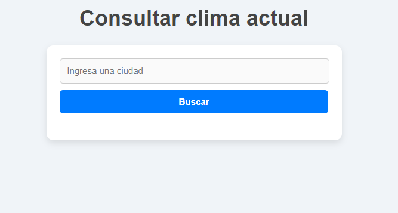
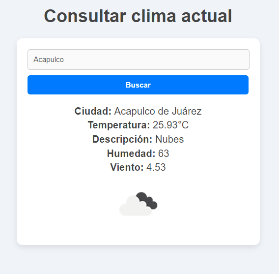
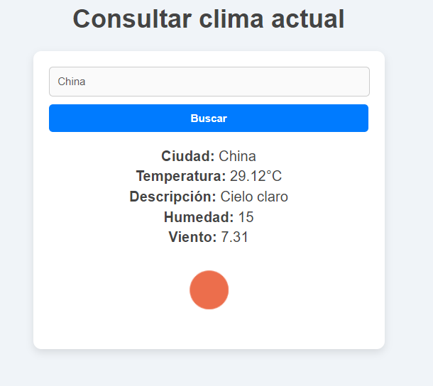
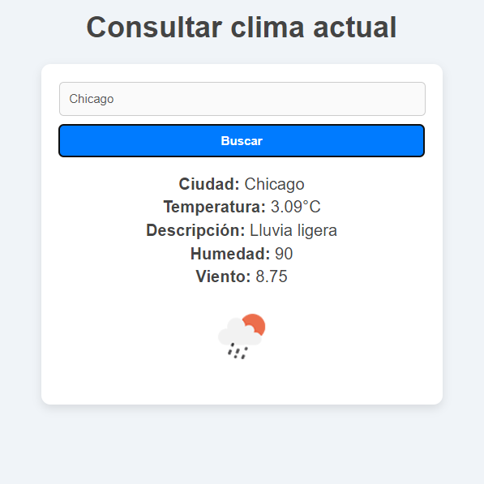

# Aplicación de Clima Actual 🌤️

Esta aplicación web te permite consultar el clima actual de cualquier ciudad en tiempo real. Desarrollada con HTML, CSS y JavaScript, integra la API de OpenWeather para proporcionar datos como temperatura, descripción del clima, humedad y velocidad del viento. Su diseño es completamente responsivo, optimizado para dispositivos móviles y de escritorio.

## Características principales
- Consulta del clima de cualquier ciudad.
- Información detallada: temperatura, descripción, humedad y velocidad del viento.
- Integración con la API de OpenWeather.

## Tecnologías utilizadas 
- **HTML5**: Estructura de la aplicación.
- **CSS3**: Estilo y diseño responsivo.
- **JavaScript**: Lógica para consumir la API y mostrar los resultados.
- **API OpenWeather**: Fuente de datos meteorológicos.

## Capturas de pantalla
### Vista principal

### Resultados del clima

